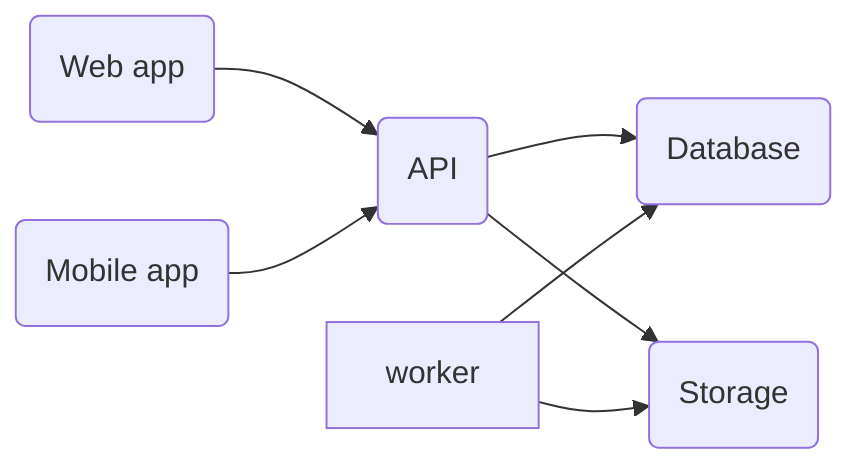

# 🙏 Thanksgiving

**Volunteers helps your non-profit in it's mission. Let's help you to _thanks_ them**.

##  What is thanksgiving app? 🎁

Non-profit organizations rely on donations to fuel their mission. They also rely on volunteers that give their time make some progress on this mission. These volunteers are motivated by your mission. Yet sometimes, it's a huge investment for them, both in time and money. Thanksgiving is an app that helps volunteers to track their volunteering time and their expenses related to their volunteering actions. Nonprofit management can then find ways to reward these actions.

Thanksgiving is quite interesting for French non-profits and volunteers. France has two ways ways to help non-profit recognize their volunteers: 

- **Travel offset from income tax**: As a volunteer, if you travel for any activity, you can make a tax deduction of the cost of your travel. 
- **Training credit**: If you volunteer for a minimum number of hours per year, you're eligible to a training credit that you can spend for any training you want - related to your work, volunteering or other activities. It's called _[Le Compte d'Engagement Citoyer (CEC)](https://www.associations.gouv.fr/cec.html)_

These two benefits require quite an amount of paperwork and - for obvious reasons - validation from the Nonprofit management. **Thanksgibing app is here to simplify this paperwork**.

## Thanksgiving, from a technical point of view 🧑‍💻

This app is being built by a team of volunteers to "scratch their own itch". By building Thanksgiving, they also use it to showcase some technical updates around Azure and Microsoft stack.

### Architecture 

| Component | Technology used | location |
|--------|------------|-------------|
| Web app | Blazor Webassembly | |
| Mobile app | .NET MAUI (standard) | |
| API | .NET Minimal API + Entity Framework | |
| Database | SQL Server | | 
| Worker | .NET Worker  | |
